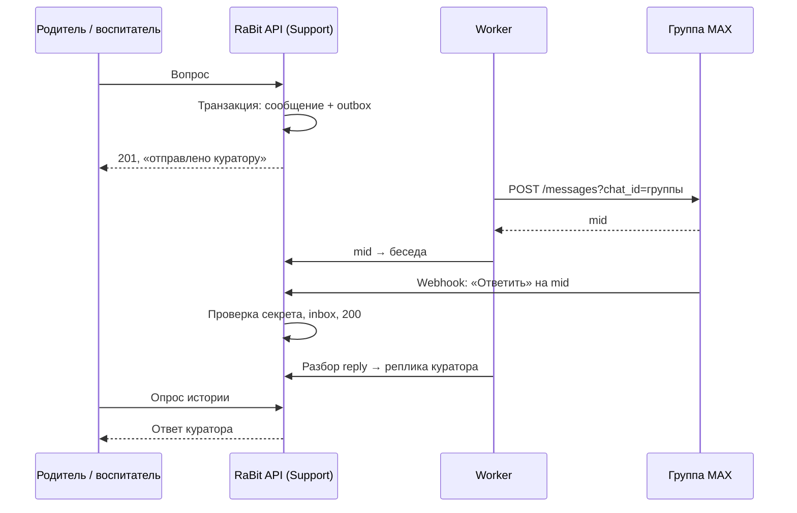

# Вопросы куратору с сайта МореФото через MAX

Первая редакция: 22.09.2026 (чат по заказу, заменена). **Текущая редакция: 25.09.2026** — постановка пользователя.
Статус: план согласован, K3 внесена в граф; продуктовый код не начат. Результат этого PR — план и изменение графа.

## 1. Цель и постановка

Родители и воспитатели задают вопросы на сайте МореФото, куратор (Рита, Алёна) получает их в MAX и отвечает
там же через «Ответить»; ответ появляется у автора на сайте.

Постановка пользователя 25.09.2026:

- Это общий канал «вопрос куратору», **не привязанный к заказу**, оплате или волне K1.
- **Родитель** не имеет аккаунта и не создаёт его: он приходит по ссылке галереи и указывает только имя.
- **Воспитатель** пишет из своего кабинета, аккаунт у него есть.
- **Куратор** работает в MAX: ему так удобнее. Родители в MAX не пишут.

## 2. Решения

| ID | Решение | Статус |
| --- | --- | --- |
| MAX-D01 | Кураторы получают вопросы в **одной закрытой группе MAX**: Рита, Алёна и бот-администратор. Отвечает свободный куратор через «Ответить» на сообщение бота | Принято 25.09.2026 |
| MAX-D02 | Родитель — по ссылке галереи и имени, без аккаунта и без заказа. Воспитатель — по сессии кабинета | Принято 25.09.2026 |
| MAX-D03 | Отдельная волна **K3** направления Support; K1 (обращения по заказу) позже расширяет тот же модуль | Принято 25.09.2026, номер волны — предложение |
| MAX-D04 | Кнопка «Вопрос куратору» — в галерее и в кабинете воспитателя | Принято 25.09.2026 |
| MAX-D05 | Родитель не получает уведомлений вне сайта: ответ виден, когда он снова откроет ссылку галереи в том же браузере | Принято 25.09.2026 |
| MAX-D06 | Срок хранения переписки и текст предупреждения «вопрос и имя передаются куратору через MAX». Предложение: хранить 12 месяцев после последнего сообщения | **Открыто**, блокирует включение на production |
| MAX-D07 | Писать из кабинета могут `teacher` и `head` (заведующая) | Принято 25.09.2026 |
| MAX-D08 | Ответ принимается от любого участника группы MAX; список разрешённых MAX-пользователей — позже | Принято 25.09.2026 |

Первая редакция (чат по личному ключу заказа, личный диалог куратора с ботом, одноразовые коды привязки) заменена
этими решениями. Её исследование MAX API сохранено в разделе 4.

## 3. Что требуется для подключения MAX (P0)

| Шаг | Кто | Состояние на 25.09.2026 |
| --- | --- | --- |
| Профиль на [платформе MAX для партнёров](https://business.max.ru/self), верификация самозанятого через Госуслуги | Пользователь | Готово: профиль «Самозанятый» подтверждён |
| Бот: «Чат-боты» → «Создать»; логотип 500×500, название «МореФото — вопросы куратору», описание до 200 символов; модерация до 48 ч по рабочим дням | Пользователь | Создан 25.09.2026: «Море Фото - вопросы куратору.», `@se14459249_bot`, тип «Добавление в чаты»; на модерации (до 1 дня) |
| Токен из настроек опубликованного бота → `~/.config/morefoto/max-bot.env` (chmod 600), на stage — `/run/secrets`, как токен Telegram. Токен не передаётся в чат, Git, план и логи | Пользователь, затем агент | Ожидает модерации |
| Закрытая группа MAX: Рита, Алёна, бот; бот назначен администратором, иначе не видит ответы | Пользователь | Ожидает модерации |
| Webhook `POST /subscriptions` на HTTPS:443 stage `app.morefoto36.ru` с секретом `X-Max-Bot-Api-Secret` | Агент | После деплоя K3 на stage |
| ID группы: `GET /chats` снят с поддержки, поэтому ID берётся из входящего события `bot_added` / сообщения в группе | Агент | После подписки webhook |

Самозанятому доступно 2 бота: тестовый для stage и боевой. Без живого бота K3 разрабатывается и проверяется
с HTTP-двойником MAX, но **включение** требует живой проверки MAX-12.

## 4. Документация MAX и ограничения

Официальная схема проверена на commit `1a4a502fab096aa3a15d83d7ea95667ffb44d2ac` (18.09.2026), страницы dev.max.ru —
22 и 25.09.2026.

| Источник | Что использовать |
| --- | --- |
| [Подключение к платформе](https://dev.max.ru/docs/maxbusiness/connection) | Юрлицо, ИП или самозанятый — резидент РФ; самозанятый верифицируется через Госуслуги |
| [Создание и модерация бота](https://dev.max.ru/docs/chatbots/bots-create/create) | Требования к карточке, модерация, токен, лимит ботов |
| [Обзор API](https://dev.max.ru/docs-api) | Host `platform-api2.max.ru`, `Authorization: <token>`, снятые методы |
| [POST /messages](https://dev.max.ru/docs-api/methods/POST/messages) | Отправка по `chat_id`, лимит текста 4000 символов, возвращаемый `mid` |
| [Webhook: POST /subscriptions](https://dev.max.ru/docs-api/methods/POST/subscriptions) | HTTPS:443, `X-Max-Bot-Api-Secret`, ответ 200 за 30 с, до 10 повторов, отписка после 8 ч сбоев |
| [Update](https://dev.max.ru/docs-api/objects/Update) | `message_created`, `bot_added`, `bot_removed` |
| [Получение chat_id](https://dev.max.ru/docs-api/use-cases/getting-chat-id) | ID группы — из входящих событий |
| [FAQ по ботам](https://dev.max.ru/help/chatbots) | Бот в группе, права администратора, управление токеном |
| [История изменений API](https://dev.max.ru/docs-api/changelog-api) | Повторная сверка перед реализацией и запуском |
| [OpenAPI schema.yaml](https://github.com/max-messenger/api-schema/blob/1a4a502fab096aa3a15d83d7ea95667ffb44d2ac/schema.yaml) | `message.body.mid`, `message.link.type = reply`, `message.link.message.mid`, контрактные фикстуры |

Ограничения, влияющие на решение:

- Нет метода создания группы — отдельный чат на каждого родителя невозможен; все вопросы идут в одну группу.
- У `POST /messages` нет ключа идемпотентности: exactly-once доставку в MAX не обещать; результат «неизвестно»
  не повторять вслепую.
- Бот публичный: личные сообщения посторонних боту игнорируются, данные сайта им не раскрываются.
- TLS не отключать; использовать актуальный host, не копировать старый из примеров.

## 5. Сценарии

**Родитель.** В галерее кнопка «Вопрос куратору» → панель чата: имя (1–60) и текст (1–2000), предупреждение о
передаче через MAX. Первый вопрос создаёт беседу и возвращает случайный ключ беседы (64 hex, в БД только SHA-256);
frontend хранит его в `localStorage` рядом с токеном галереи. Следующие сообщения и история — по заголовку
`X-Question-Key`. Сменил браузер или очистил данные — видит новую пустую беседу (ограничение MAX-D02/D05).
Ответ виден при открытом чате (опрос раз в 15 с на видимой вкладке) и отметкой «Новый ответ» при следующем
открытии галереи.

**Воспитатель.** В кабинете раздел «Вопрос куратору»: одна беседа на сотрудника, история доступна с любого
устройства по сессии. Контекст — учреждение сотрудника.

**Куратор в MAX.** Бот публикует в группу:

```
Вопрос №124 · родитель «Мария»
Сад «Солнышко», группа «Пчёлки», куратор группы: Рита
———
Текст вопроса
———
Чтобы ответить, нажмите «Ответить» на этом сообщении.
```

Повторное сообщение той же беседы — новое сообщение бота с тем же номером. «Ответить» на **любое** сообщение бота
этой беседы добавляет реплику куратора в неё; автор — имя отправителя MAX. Обычные сообщения кураторов в группе,
ответы на чужие сообщения, пересылки, правки и удаления в историю не попадают, бот на них не реагирует.



## 6. Scope и исключения

**Входит в K3:** беседы родителя и воспитателя, текст в обе стороны, доставка в группу MAX с восстановлением,
webhook с дедупликацией, панель чата в галерее, раздел в кабинете воспитателя, лимиты и антиспам, наблюдаемость,
команда подписки webhook, фикстуры MAX и живая проверка на stage.

**Не входит:** привязка к заказу и оплате (K1), файлы/фото/голос, уведомления родителю по email/SMS/MAX,
рабочее место куратора на сайте, назначение ответственного, список разрешённых MAX-пользователей, ИИ-ответы,
редактирование и удаление реплик, личные диалоги родителя с ботом.

## 7. Архитектура

**Владелец — новый модуль `morefoto.support`** (`Morefoto\Support`). Domain — беседа, реплика, правила длины и
автора; Application — UseCase «задать вопрос», «дописать», «получить историю», «доставить в MAX», «принять ответ»;
Presentation — пассивные `*RequestDto`/`*ResultDto` и mapper; Infrastructure — репозитории, outbox/inbox,
webhook-обвязка, адаптеры. Контроллеры по правилам CLAUDE.md: один request DTO, только UseCase и общий ответ;
секрет webhook и ключ беседы разбирает общая infrastructure-обвязка. `LogChannelEnum` — `support`; текст сообщений,
ключи, токен и сырые payload не логируются.

**MAX — транспортная граница.** Технический контракт `rebit.share/lib/Application/Contract/Messenger/`
(отправить текст в чат → `mid` | отказ | неизвестно; разобрать update), HTTP-реализация в
`rebit.notification/lib/Infrastructure/Max/` поверх общего HTTP-клиента. Маршрутизация ответа и состояние доставки
принадлежат Support. H1 EMAIL не меняется; универсальная система каналов не вводится.

**Контекст галереи** — через публичный контракт `rebit.share/lib/Contracts/Media/` с реализацией в
`morefoto.media` (разрешить `gallery_token` → группа, учреждение, куратор, признак доступности). **Контекст
воспитателя** — через контракт Access/Organization. Support не читает чужие таблицы.

**Надёжность** — по образцу H1: outbox в одной транзакции с репликой, публикация в RabbitMQ как сигнал,
периодический dispatcher дожимает pending, lease и порядок сообщений одной беседы. Inbox отвечает 200 только после
фиксации; дедупликация по `botId + mid`; неверный секрет — 401, валидное неподдерживаемое событие — 200 без
действий. События `bot_added`/`bot_removed` сохраняются для получения ID группы (команда `support:max:chats`).
ID рабочей группы — настройка окружения; сообщения из других чатов игнорируются.

**Хранение** (миграции в `migrations.foundation/`): беседа (тип автора, галерея или сотрудник, имя, хеш ключа,
номер, время последнего ответа), реплика (автор, текст, время), outbox, связь `mid` → беседа, inbox.
Чтение — ORM D7 или SQL с массивами, без Objectify-коллекций.

**Лимиты:** новая беседа — 5 в час на IP и галерею; сообщения — 20 в час на беседу; тело до 8 КБ;
вывод — plain text с экранированием. Отказ — 429 `RATE_LIMITED`.

## 8. API (предложение, новые ID вводятся при изменении графа)

| ID | Метод и путь | Кто | Суть |
| --- | --- | --- | --- |
| SUP-07 | `POST /public/galleries/{gallery_token}/questions` | Галерея | name, message, `Idempotency-Key` → 201: id, number, questionKey, messages |
| SUP-08 | `GET /public/questions/current` | `X-Question-Key` | История беседы родителя; неверный ключ — 404 |
| SUP-09 | `POST /public/questions/current/messages` | `X-Question-Key` | Следующее сообщение, `Idempotency-Key` |
| SUP-10 | `GET /questions/mine` | Воспитатель (Bearer) | Своя беседа и история; пустая — 200 без сообщений |
| SUP-11 | `POST /questions/mine/messages` | Воспитатель (Bearer) | Сообщение; первая реплика создаёт беседу |
| SUP-12 · И | `POST /webhooks/max/updates` | MAX | Секрет `X-Max-Bot-Api-Secret` → 200 acknowledged |

Ответы `Cache-Control: no-store`. Повтор с тем же `Idempotency-Key` и телом возвращает прежний результат,
с другим телом — 409 `IDEMPOTENCY_CONFLICT`. Реплика содержит `author` (`parent`/`teacher`/`curator`), имя,
текст, время и для своих сообщений статус доставки (`sending`/`delivered`/`failed`).

## 9. Зависимости и граф

- K3 зависит только от слитых волн: **F2** (ссылка галереи), **E4** (MED-01, куратор группы), **B2** (сотрудники и
  роли), **H1** (образец надёжной доставки и consumer), **B4** (кабинет воспитателя). Все в `main`.
- Предлагается `K1.dependsOn += K3`: K1 расширит модуль Support, а не создаст второй. Решение фиксируется при
  изменении графа.
- Граф изменён в этом PR: K3 в `docs/waves/graph.json` (116 API ID) и в каноне MoreFoto (118: там уже есть
  PAY-10/11 незамерженной G1). Изменения канона — [`docs/waves/k3/morefoto-contract.patch`](../../waves/k3/morefoto-contract.patch):
  `build.py` (SUP-07…12, доступ «Вопрос» и «MAX»), `validate.py`, `backend-waves.json` и сгенерированные карты,
  реестр, Postman. `K1.dependsOn` дополнен K3. Сведение `endpointCount` с G1 — при merge второго из PR.
- Реализация — отдельная ветка `codex/k3-max-curator-questions` от актуального `main` после merge этого PR;
  один PR. Оценка — 4–5 тыс. строк, одна волна.

## 10. Риски

| Риск | Мера |
| --- | --- |
| Родитель теряет беседу при смене браузера | Осознанное ограничение MAX-D02/D05; при необходимости — необязательный email в следующей волне |
| Имя не подтверждается, возможен спам | Лимиты, длина, контекст галереи; куратор видит, откуда вопрос |
| Любой участник группы может ответить | Группу ведут кураторы; allow-list — MAX-D08 |
| Отписка webhook после 8 ч сбоя | Метрика возраста последнего события, команда повторной подписки, runbook |
| Передача ПДн (имя, текст) в MAX | Предупреждение в форме, срок хранения MAX-D06 до production |
| Модерация бота задерживает живую проверку | Разработка с HTTP-двойником; включение только после MAX-12 |

## 11. Checklist

Этот PR (план и граф):

- [x] Перечитать постановку, прежний план, граф, модули Media/Access/Notification и роли кабинета.
- [x] Сверить требования MAX к профилю, боту и модерации (25.09.2026).
- [x] Переписать план под постановку 25.09.2026 и обновить progress.
- [x] Подготовить логотип бота 500×500 (вне репозитория).
- [x] Согласовать план и открытые решения MAX-D07, MAX-D08.
- [x] Добавить K3 и SUP-07…12 в граф, канонический план и реестр API; прогнать проверку DAG.
- [ ] Обновить описание PR 48, снять draft, передать на review.

Волна K3 (отдельный PR):

- [ ] Контракты Media/Access и MAX-транспорта в `rebit.share`, их реализации у поставщиков.
- [ ] Модуль `morefoto.support`: миграции, Domain, UseCase, DI, маршруты, outbox/inbox, consumer и dispatcher.
- [ ] Frontend: панель в галерее, раздел кабинета воспитателя, состояния и ошибки.
- [ ] Unit/architecture-тесты границ, HTTP-тесты контракта, E2E с HTTP-двойником MAX (spec в `groups.json`).
- [ ] Stage: токен в secrets, подписка webhook, ID группы, живая проверка MAX-12, desktop/mobile MAX-13.

## 12. Критерии приёмки K3

1. Родитель по ссылке галереи задаёт вопрос с именем, видит его и ответ куратора после перезагрузки в том же браузере.
2. Воспитатель задаёт вопрос из кабинета и видит ответ на любом устройстве.
3. Вопрос появляется в группе MAX с номером, автором и контекстом; «Ответить» возвращает текст ровно в эту беседу.
4. Чужой ключ, чужая галерея, закрытая ссылка, повторы и сбои MAX/RabbitMQ не дают утечки, дублей или потерь.
5. Токен, секрет и тексты не попадают в логи и Git; наблюдаемость показывает зависшую доставку и тишину webhook.
6. Backend/frontend quality gates, `make test-e2e`, живая проверка на stage и визуальная проверка пройдены.

## 13. Тест-кейсы

Этот PR:

| ID | Предусловия → действие | Ожидаемый результат | Команда |
| --- | --- | --- | --- |
| DOC-01 | План готов → diff от `origin/main` | Только план, progress, `graph.json` и патч канона; runtime-кода нет | `git diff --name-only origin/main...HEAD` |
| DOC-02 | Источники MAX → открыть страницы | Требования к профилю, боту, webhook совпадают с планом | Открытие dev.max.ru |
| DOC-03 | K3 добавлена → проверить граф и канон | DAG корректен, покрытие API учитывает SUP-07…12, K3 ready; канон и Postman валидны, патч накладывается | `python3 tools/verify-wave-graph.py docs/waves/graph.json`; в MoreFoto `wave_graph.py`, `render-waves.py`, `build.py`, `validate.py`, `validate-postman.cjs`; `patch -p1 --dry-run` |
| DOC-04 | Документы готовы → структура и ссылки | `git diff --check` чист; каждый ID из плана есть в progress | `git diff --check origin/main...HEAD` |
| DOC-05 | PR обновлён → сверить PR | base `main`, нужная ветка, состав файлов | `gh pr view 48 --json baseRefName,headRefName,isDraft,files` |

Волна K3 (все PENDING до реализации):

| ID | Предусловия → действие | Ожидаемый результат | Команда |
| --- | --- | --- | --- |
| MAX-01 | Открытая галерея → родитель задаёт вопрос, повтор с тем же `Idempotency-Key` | Одна беседа, одна реплика, один outbox; другое тело — 409 | `make test-e2e` |
| MAX-02 | Две беседы, два ключа → чтение и запись чужим ключом, без ключа, с отозванной галереей | 404 без различия причин; чужая история не видна | `make test-e2e` |
| MAX-03 | Родитель после ответа → перезагрузка в том же браузере | История и «Новый ответ» на месте | `make test-e2e`, Chromium |
| MAX-04 | Воспитатель → вопрос из кабинета; вход с другого браузера | Одна беседа, история видна; роли вне MAX-D07 — 403 | `make test-e2e` |
| MAX-05 | HTTP-двойник MAX → доставка вопроса | Текст с номером и контекстом отправлен в ID группы; `mid` сохранён | `make test-e2e` |
| MAX-06 | Две беседы в группе → «Ответить» на старое сообщение каждой | Ответ попадает только в свою беседу | `make test-e2e` |
| MAX-07 | Webhook: неверный секрет, чужой чат, сообщение без reply, reply на чужое, пересылка, правка, удаление | Секрет — 401; остальное 200 без изменения истории | `make test-e2e` |
| MAX-08 | Webhook повторён, параллельный повтор, сбой БД | Ровно одна реплика; при сбое БД не 200 | `make test-e2e` |
| MAX-09 | MAX/RabbitMQ недоступны, ответ MAX потерян | Реплика сохранена, dispatcher дожимает pending, неизвестный результат виден и не дублируется | `make test-e2e` |
| MAX-10 | HTML/script, emoji, 2000 символов, превышение лимитов | Экранирование; 422/429 предсказуемы | `make test-e2e` |
| MAX-11 | Логи после сценариев MAX-01…10 | Нет токена, ключей, секретов и текстов сообщений | Проверка логов стенда E2E |
| MAX-12 | Stage, живой бот, группа с кураторами → полный цикл | Сайт → группа MAX → «Ответить» → сайт; личное сообщение боту игнорируется | Ручной сценарий на `app.morefoto36.ru` |
| MAX-13 | Готовый UI → desktop 1440×1000, mobile 390×844 | Панель, длинный текст, ошибки и клавиатура не ломают экран | Снимки экранов стенда |

HTTP-двойник MAX закрывает MAX-05…09 только на уровне контракта; готовность интеграции подтверждает MAX-12.
