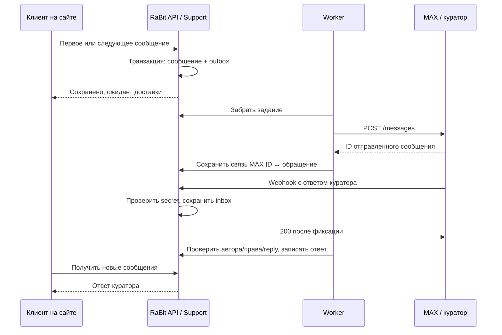

# Чат клиента MoreFoto36.ru с куратором через MAX

Дата исследования: **22.09.2026**. Статус: **предложение для обсуждения, без реализации**.
Результат текущей задачи — документационный PR. Варианты UX и изменение очередности волн ещё не утверждены.

## 1. Вывод и предлагаемый сценарий

**Двусторонний чат реализуем:** клиент пишет на сайте, RaBit API сохраняет сообщение и отправляет его боту MAX; куратор отвечает в MAX, ответ появляется в истории клиента на сайте. У клиента может вообще не быть аккаунта MAX.

**Автоматически создавать отдельный нативный чат MAX для каждого клиента пока не закладываем.** В опубликованном перечне методов и проверенной официальной OpenAPI-схеме нет операции создания группового чата. Это вывод по документации, без эксперимента с рабочим ботом. Отправка сообщения существующему пользователю/чату не создаёт произвольные независимые диалоги «один клиент — один чат» у куратора. Источники: [API MAX](https://dev.max.ru/docs-api), [официальная схема, проверенная ревизия](https://github.com/max-messenger/api-schema/blob/1a4a502fab096aa3a15d83d7ea95667ffb44d2ac/schema.yaml).

| Вариант рабочего места куратора | Реализуемость и ограничения | Предложение |
| --- | --- | --- |
| Личный диалог куратора с ботом | Один диалог MAX, внутри сообщения разных обращений; адресат определяется по «Ответить» на конкретное сообщение | Первая версия |
| Заранее созданная закрытая группа сотрудников | Бот пересылает сообщения в эту группу; нужны права чтения и единая допустимая область видимости всех участников | Альтернатива после проверки доступа |
| Отдельная группа MAX на каждого клиента | Ручное создание и добавление бота возможно как организационный процесс; автоматическое создание не подтверждено официальным API | Не обещать автоматизацию |
| Список отдельных обращений внутри мини-приложения MAX | Может дать удобный список диалогов внутри одного бота, но это дополнительный интерфейс | После проверки востребованности |

Для группы нужно разрешить добавление бота в настройках платформы; для получения всех новых сообщений бот должен иметь соответствующие права администратора. Наличие человека в группе само по себе не даёт ему права отвечать клиенту. [FAQ MAX](https://dev.max.ru/help/chatbots), [MessageCreatedUpdate в OpenAPI](https://github.com/max-messenger/api-schema/blob/1a4a502fab096aa3a15d83d7ea95667ffb44d2ac/schema.yaml).

Пример UX: клиент пишет «Когда будут готовы фотографии?»; куратор получает «Обращение MF-S-1042 · заказ MF-…», текст и ссылку на служебную карточку. Куратор нажимает штатное **«Ответить»** на это сообщение. На сайте появляется ответ с подписью «Куратор». Номер в тексте помогает человеку, но не служит ключом маршрутизации.

## 2. Цель, scope и границы первой версии

Цель бизнеса — дать родителю один сохраняемый диалог и позволить куратору отвечать из привычного мессенджера. Стек сохраняется: PHP 8.4, Bitrix D7, MySQL, RabbitMQ; существующий frontend Vue 3/Vite/Vuetify. Новый Node-сервис для MAX не требуется: официальный HTTP API доступен из PHP.

**Предлагаемый MVP:** текстовая переписка по конкретному заказу, доступная по личному ключу покупателя. Один активный диалог на заказ; несколько заказов не объединяются по имени/email. Создание, повторные сообщения обеих сторон, история, непрочитанные ответы, очередь куратора на сайте, назначение ответственного и наблюдаемый статус доставки в MAX.

Это ограничение MVP, а не подмена исходного запроса. Если чат нужен посетителю **до заказа**, отдельно добавляется гостевая сессия с собственным случайным секретом, восстановлением и защитой от спама. Общий ключ галереи/группы не идентифицирует родителя и не может давать доступ к чужой переписке. Выбор фиксируется в CHAT-D02 до продуктового кода.

Вне MVP: файлы и фотографии, голосовые, звонки, автоматические ответы ИИ, перенос всей поддержки в мессенджер, интеграция оплат/возвратов/продления сроков из текста чата, редактирование или удаление уже отправленных реплик, гостевой чат без утверждённой модели доступа. MAX клиента и уведомление клиента вне сайта — отдельные каналы, их не считать частью мостика к куратору.

Текущий PR содержит только этот план и [progress.md](progress.md). Реализация, активный DAG, 99 API ID, production, секреты и действующие боты не меняются.

## 3. Что уже есть в RaBit API

Сверено с `origin/main` = `5b750c07e964e279e3517292dae6517643f3e7be`.

| Основа | Фактическое состояние | Следствие |
| --- | --- | --- |
| `rebit.auth`, `morefoto.access`, B2 | Идентичность сотрудников, роли и назначения существуют | Проверять живые права/назначения, не доверять MAX username |
| `morefoto.organization`, C4 | Учреждения/группы и календарь реализованы | Контекст заказа и назначение куратора разрешать сервером |
| `morefoto.commerce`, E5 | Заказ и личный ключ покупателя реализованы | Есть основание для чата по заказу; публичный межмодульный контракт доступа для Support ещё нужно спроектировать |
| `rebit.notification`, H1 | Надёжная **EMAIL**-доставка, consumer и восстановление pending | Это не готовый MAX-канал; `EmailNotificationInterface` нельзя использовать как универсальную отправку |
| `rebit.share` | Общие Auth/Messenger-контракты и предметные `Contracts/*` | Использовать существующую инфраструктуру, добавлять только необходимые границы |
| `morefoto.support`, K1 | Модуля пока нет; волна `planned`, `dependsOn: I3, J3`, `decisionGates: D07, D08, D12` | Полную K1 сейчас нельзя объявлять готовой к реализации; D12 не отмечен принятым в графе |

Источники проекта: [архитектура](../../architecture.md), [граф](../../waves/graph.json), [H1](../H1_reliable-email/plan.md). Канонический продуктовый план: `/home/user/MoreFoto/docs/04-bitrix-modules/backend-waves.json`; спецификация API: `/home/user/MoreFoto/docs/05-rest-api/README.md` (раздел Support, SUP-01…06). Соседний checkout не является зависимостью сборки этого PR.

Существующий `/api/v1/lead` и LeadHunter сохраняют свои сценарии. Они не хранят двустороннюю переписку и не заменяют Support. В `docs/architecture.md` есть исторические описания ранних Access/Notification; актуальные возможности подтверждены кодом и графом, эти разделы стоит обновить отдельной документарной правкой.

## 4. Документация MAX: что читать и зачем

Все перечисленные страницы открыты при исследовании; GitHub читался только через `gh`. Версия OpenAPI зафиксирована коммитом от 18.09.2026.

| Источник | Что использовать |
| --- | --- |
| [Создание и модерация бота](https://dev.max.ru/docs/chatbots/bots-create/create) | Верифицированный профиль юрлица, ИП или самозанятого — резидента РФ; создание, модерация, получение токена |
| [Обзор API](https://dev.max.ru/docs-api) | Актуальный host `platform-api2.max.ru`, `Authorization: <token>`, доступные методы |
| [Отправка сообщений: POST /messages](https://dev.max.ru/docs-api/methods/POST/messages) | Отправка по `user_id` либо `chat_id`, возвращаемое сообщение, лимит текста 4000 символов |
| [NewMessageBody](https://dev.max.ru/docs-api/objects/NewMessageBody) | Текст, форматирование, вложения, ссылка на исходное сообщение |
| [Message](https://dev.max.ru/docs-api/objects/Message) | Отправитель, получатель, содержимое и связь reply/forward |
| [Webhook: POST /subscriptions](https://dev.max.ru/docs-api/methods/POST/subscriptions) | HTTPS:443, TLS, `X-Max-Bot-Api-Secret`, подтверждение события и повторные доставки |
| [Update](https://dev.max.ru/docs-api/objects/Update) | `message_created`, `bot_started`, `bot_stopped`, события удаления и изменения сообщения |
| [Получение chat_id](https://dev.max.ru/docs-api/use-cases/getting-chat-id) | Сохранять ID из входящих событий, не строить обнаружение чатов через GET /chats |
| [FAQ по ботам](https://dev.max.ru/help/chatbots) | Настройка групп, публичная обнаружимость бота, управление токеном |
| [История изменений API](https://dev.max.ru/docs-api/changelog-api) | Повторная проверка совместимости перед разработкой и запуском |
| [OpenAPI: schema.yaml](https://github.com/max-messenger/api-schema/blob/1a4a502fab096aa3a15d83d7ea95667ffb44d2ac/schema.yaml) | Точные поля `MessageBody.mid`, `LinkedMessage.message.mid`, типы событий и контрактные фикстуры |
| [Медиафайлы — следующий этап](https://dev.max.ru/docs-api/use-cases/sending-messages/media) | Порядок uploads → token → messages; в MVP вложения не поддерживаются |

Текущие ограничения, которые влияют на решение:

- Использовать новый API-host и корректный доверенный CA bundle согласно требованиям MAX. Проверку TLS не отключать. Старый host из примеров не копировать. [История изменений](https://dev.max.ru/docs-api/changelog-api).
- `GET /chats` снят с поддержки. `POST /chats/{chatId}/members` ограничен с 09.09.2026, удаление заявлено на 30.09.2026. Поэтому не проектировать автоматическое создание/наполнение групп. [Обзор API](https://dev.max.ru/docs-api).
- Webhook должен отвечать `200` не позднее 30 секунд; документация описывает до 10 повторов и автоматическую отписку после 8 часов неуспешной доставки. Long polling не использовать как production-основу. [Подписки](https://dev.max.ru/docs-api/methods/POST/subscriptions).
- При `message_created` входящее сообщение находится в `update.message`; ID — `message.body.mid`. Для ответа `message.link.type = reply`, ссылка на исходную реплику — `message.link.message.mid`. Не путать входящий `LinkedMessage` с исходящим `NewMessageLink`, где используется `mid`. [OpenAPI](https://github.com/max-messenger/api-schema/blob/1a4a502fab096aa3a15d83d7ea95667ffb44d2ac/schema.yaml).
- Для `POST /messages` в проверенной схеме нет документированного ключа идемпотентности. Доставку exactly-once во внешнем мессенджере не обещать. В схеме и веб-странице расходится описание `disable_link_preview`; точное поведение проверить живым запросом и не делать безопасность зависимой от этого флага.

## 5. Сценарии и интерфейс

1. **Подключение куратора.** В авторизованном служебном кабинете сотрудник получает одноразовый код с коротким сроком жизни, открывает бота и отправляет код. Backend связывает `staffId` с числовым `maxUserId` и проверенным диалогом. Код одноразовый, хранится хеш; отзыв/повторная привязка доступны владельцу и уполномоченному организатору. Имя, телефон и `/start` без кода не подтверждают роль.
2. **Первое сообщение.** Backend разрешает личный ключ и заказ, проверяет право, атомарно создаёт обращение/реплику/outbox. Повтор с тем же `Idempotency-Key` и payload возвращает прежний результат; другой payload даёт 409. Право доступа проверяется и при replay.
3. **Выбор куратора.** Из заказа разрешается учреждение и действующие назначения Access. Один ответственный закрепляется за обращением. При отсутствии доступного куратора обращение остаётся в служебной очереди организатора со статусом «Нужен ответственный». При нескольких кандидатах применяется согласованное правило, без случайной рассылки всем.
4. **MAX.** Отправляются номер обращения, минимальный контекст и текст. В ссылке на карточку нет личного ключа покупателя; кабинет требует staff-auth. Внешний `mid` сохраняется для каждой пересланной реплики, а не только для первой.
5. **Ответ.** Webhook после проверки секрета сохраняется в inbox. Worker сверяет отправителя, диалог, принадлежность исходного `mid`, активную привязку, актуальное назначение и права. Ответ добавляется в ту же историю. Сообщение без корректного reply не публикуется клиенту: бот объясняет куратору, как выбрать обращение. Нельзя угадывать адресата по «последнему открытому чату».
6. **Обновление сайта.** В MVP — запрос новых реплик по непрозрачному cursor примерно каждые 3–5 секунд при открытом окне; при скрытой вкладке пауза, при возврате немедленное обновление, при ошибке backoff. Целевое время появления ответа — до 10 секунд при исправных системах, это проверяемая цель проекта, не гарантия MAX. WebSocket/SSE можно добавить позже.
7. **Закрытая вкладка.** Ответ сохраняется и виден после возвращения клиента. Email-уведомление можно согласовать отдельным шагом через H1; в MVP уведомление вне сайта не обещается.
8. **Редактирование, вложения, удаление в MAX.** Для MVP клиенту передаётся только новая текстовая реплика. Неподдерживаемое вложение получает понятный отказ; edit/delete не переписывает историю сайта. Куратор видит подсказку об этом при подключении.

В UI различать «сохранено на сайте», «передано в MAX», «ошибка доставки». Успешный HTTP-ответ MAX не доказывает прочтение куратором. На сайте отдельно хранить прочтение клиентом. Поле текста — до 2000 символов для новых реплик (предложение), чтобы оставалось место для контекста MAX; SUP-01 сейчас задаёт 10–2000 для первого обращения, этот контракт не менять молча.

## 6. Архитектура, данные и надёжность

**Владелец переписки — `morefoto.support`.** Domain хранит правила обращения, статусов и доступа; Application — законченные сценарии создания, добавления сообщения и ответа; Presentation — пассивные request/result DTO и mapper; Infrastructure — вебхуки, очередь, хранилища технических операций и адаптеры.

Контроллеры соответствуют AGENTS.md: один типизированный request DTO, UseCase, общий API ответа. Secret webhook проверяет инфраструктурная обвязка, а не concrete controller. DTO не содержат методов; у изменяемых UseCase/Service есть содержательный русский class-level phpDoc. Миграции — `api/public/local/php_interface/migrations.foundation/`.

**MAX — транспортная граница.** Предлагается узкий технический `MaxMessageTransportInterface` в `rebit.share/lib/Application/Contract/Notification/`, HTTP-реализация — `rebit.notification/Infrastructure/Max/`. Он возвращает внешний ID либо типизированный результат отказа/неопределённости. Привязка куратора, маршрутизация reply и состояние доставки конкретной реплики принадлежат Support. H1 EMAIL остаётся самостоятельным; не вводить универсальную систему каналов ради одного сценария. Размещение — проектное предложение, требующее review до кода.

Предметные межмодульные возможности (доступ покупателя к заказу, получатели по учреждению) вводить через `rebit.share/lib/Contracts/<Domain>/` с реализацией у Commerce/Access. Нужные контракты должны быть слиты до начала использующей их волны либо вводиться вместе с законченным сценарием в согласованной одной волне. Не читать чужие таблицы из Support и не обращаться к внутренним UseCase поставщика.

Минимальные логические записи (имена таблиц предварительные):

| Запись | Существенные данные и инварианты |
| --- | --- |
| Обращение | UUID, номер, orderId, institutionId, assigneeId, status, revision; уникальность активного диалога по заказу обеспечена БД |
| Реплика | UUID, caseId, последовательность внутри обращения, автор/направление, текст, время; история append-only |
| Idempotency | Область доступа + client key + hash payload + результат; конкурентный повтор не создаёт вторую реплику |
| Привязка MAX | staffId, maxUserId, dialogId, botId, active, версия; уникальность активной привязки, отзыв |
| Outbox / доставка | messageId, recipientBinding/version, status, attempts, nextAttemptAt, lease, externalMid; атомарно с записью реплики |
| Inbox и внешние связи | botId + updateType + входящий mid для дедупликации; внешний mid + диалог → case/message; обработка и ответ фиксируются согласованно |

Тексты — в нашей БД; MAX не источник основной истории. Для чтения — Result/массивные строки, устойчивые индексы и ограниченная пагинация. Курсор опирается на порядок фиксации/сериализацию внутри обращения, а не на время клиента; конкурентный commit не должен приводить к пропущенной реплике.

- Outbox создаётся в транзакции с сообщением. Сетевой вызов MAX выполняется после commit. Публикация в RabbitMQ — сигнал; периодический dispatcher восстанавливает pending, если брокер был недоступен. Worker захватывает задание по lease, сохраняет порядок сообщений одного обращения.
- Inbox получает `200` только после надёжной фиксации. Повтор webhook возвращает `200`, но не создаёт вторую реплику. Если БД недоступна — не подтверждать событие. Некорректный secret отклонять; валидное, но неподдерживаемое событие безопасно подтверждать без публикации клиенту.
- Проверять права перед внешней отправкой и перед записью ответа: увольнение/смена назначения должны отменять ещё не выполненные задания старому куратору. Уже прочитанное в MAX невозможно отозвать из памяти получателя.
- Ограничить глобальную частоту запросов, задать timeout и backoff с jitter. Повторять лишь известные безопасные отказы. Если MAX мог принять сообщение, но ответ потерян, фиксировать `deliveryUnknown`, не запускать слепой повтор. Инструмент ручной сверки/повтора предупреждает о возможном дубле и пишет аудит; обнаруженные внешние дубли связываются с тем же обращением.
- Восстанавливать зависшие lease; неизвестную исходящую доставку или ответ на ещё не сохранённый исходный mid помещать в разбор, не терять и не маршрутизировать по догадке.
- Наблюдаемость: возраст pending/inbox, retry/unknown/failed, остановка бота, возраст последней успешной обработки, проверка наличия webhook-подписки. После отписки MAX нужен контролируемый re-subscribe и разбор пропущенного интервала, не обещание бесконечного replay.
- Секреты — runtime secret store; содержимое чата, ключи доступа, токены и сырые webhook payload не попадают в логи. В persisted inbox хранить только нужные поля с ограниченным сроком, без auth headers. Сроки хранения переписки/удаления и предупреждение клиенту о передаче сообщения куратору через MAX утвердить до запуска.
- Rate limit, ограничение длины/размера тела, вывод plain text с экранированием, защита от IDOR и проверка всех link ID обязательны. Bot API публично доступного бота не должен раскрывать данные неизвестному MAX-пользователю.

## 7. Контракт сайта и связь с SUP-01…06

Канонические SUP-01/02 уже описывают создание и историю обращений, SUP-03/04/05 — список, карточку и ответ сотрудника. **Этого ещё недостаточно для многоходового чата:** отдельная операция повторного сообщения покупателя и инкрементальное чтение истории требуют согласования.

| Операция | Предлагаемое решение |
| --- | --- |
| Создать обращение | Сохранить SUP-01: `POST /api/v1/public/orders/current/support-requests`; личный ключ, идемпотентность |
| Повторное сообщение покупателя | Новый маршрут `POST /api/v1/public/orders/current/support-requests/{id}/messages`; доступ к текущему заказу, текст, Idempotency-Key |
| Новые сообщения | Новый `GET /api/v1/public/orders/current/support-requests/{id}/messages?after=…&limit=…`; устойчивый cursor, без staff-private полей |
| Очередь/карточка/ответ сотрудника | Использовать смысл SUP-03/04/05; ответ из MAX вызывает тот же Application-сценарий после инфраструктурной аутентификации |
| Подключение MAX | Staff-auth endpoints для получения/отзыва кода привязки и просмотра безопасного статуса |
| MAX webhook | Отдельный `POST /api/v1/integrations/max/webhook` с secret-проверкой; без Bearer покупателя/куратора |

Это эскизы, **не зарегистрированные API**. Новые ID назначаются только при изменении канонического источника и генераторов. Текущие 99 API ID сохраняются; новые операции нельзя спрятать под старый ID или убрать проверку покрытия. SUP-06 и любое управление деньгами/сроками чату не передаются. Endpoint истории не возвращает личный ключ, контакты другого родителя, служебные заметки или внутренние MAX ID.

## 8. Зависимости и этапы реализации

### Выбор очередности

1. **В рамках текущего графа:** дождаться merge I3/J3 и закрытия decision gates, выполнить K1, затем отдельную волну мостика MAX. `K1.unlocks = [L1, K2]` остаётся неизменным в этом PR; новая обратная связь появится только после официального обновления DAG.
2. **Если чат нужен раньше:** отдельным решением выделить из будущего Support законченный текстовый сценарий по заказу, опирающийся на уже слитые E5/B2/C4 и общую основу. В нём должны быть реальные хранение, права, UseCase, DI, HTTP, очередь куратора и браузерный E2E. Финансовая/файловая проекция и продления остаются в зависимых волнах. Сначала изменить канонический план и карты, проверить DAG/покрытие/готовность, затем реализовывать. Не начинать такую волну по одному этому документу.

Ниже — последовательность результатов, **не присвоенные номера волн**. Каждому самостоятельному продуктовому срезу при утверждении назначается свободный ID и отдельный `codex/<буква><номер>-…` PR от актуального main; зависимости предыдущего среза должны быть merged.

| Этап | dependsOn / вход | Законченный выход | unlocks / проверка merge |
| --- | --- | --- | --- |
| P0: доступ и проверка MAX | Утверждён UX, верифицированный профиль, модерированный бот, тестовые сотрудники, HTTPS стенд | Зафиксированы live send → reply → webhook, поля событий, таймауты/ошибки; секреты не в Git | Разблокирует MAX-мостик; это исследование интеграции, не самостоятельная продуктовая волна |
| P1: текстовый Support на сайте | K1 dependencies/gates по текущему DAG **или** заранее утверждённое выделение раннего среза | Клиент и куратор переписываются на сайте с сохранением, правами, очередью и повторными сообщениями | Разблокирует P2; миграции, DI, backend/frontend, настоящий HTTP/browser E2E и desktop/mobile |
| P2: мостик MAX | P0 подтверждён, P1 и нужные контракты уже merged, CHAT-D01…06 решены | Привязка сотрудников, outbox/inbox, двусторонние ответы, ошибки/повторы/отзыв, настройки и runbook | Разблокирует P3; отдельная проверка main + own diff, regression P1, живой MAX round-trip |
| P3: запуск | P2 прошёл review и merged; задан ответственный, мониторинг, секреты, retention | Пилот на ограниченном числе кураторов, проверенное отключение канала с сохранением истории | Отдельное действие deployment; расширять после подтверждения пилота |

Для P1 браузер и БД настоящие, MAX ещё не нужен. Для P2 контрактные фикстуры MAX покрывают сбои, но **не заменяют** отдельный живой тест с мессенджером. Пока P0 не пройден, нельзя утверждать, что интеграция проверена.

## 9. Решения до продуктового кода

| ID | Предложение / открытый вопрос | Что блокирует |
| --- | --- | --- |
| CHAT-D01 | Личный диалог куратора с ботом; пользовательский ответ на выбор UX пока не получен | Финальную маршрутизацию и UX MAX |
| CHAT-D02 | Первая версия по заказу; нужен ли чат до покупки и как восстанавливать гостевую сессию | Идентификацию покупателя и публичные API |
| CHAT-D03 | Один ответственный, без куратора — очередь организатора; правило выбора при нескольких назначениях | Назначение и уведомления |
| CHAT-D04 | Следовать K1 или выделить ранний текстовый срез; дополнить API/канонический граф до реализации | Старт продуктовых волн |
| CHAT-D05 | Подтверждённый профиль/модерация, тестовый бот и разрешённые участники для P0 | Live-проверку и запуск MAX |
| CHAT-D06 | Срок хранения, доступ после истечения личного ключа E5, порядок перепривязки/отзыва, информирование клиента | Production; просроченный ключ нельзя автоматически продлевать ради чата |

Цена и срок разработки здесь не фиксируются: сначала решения и P0. Техническая реализуемость мостика подтверждена контрактами API, работоспособность конкретного бота ещё не проверена.

## 10. План текущего документационного PR

- [x] Прочитать AGENTS.md/CLAUDE.md, сверить main, существующие PR/issues и планы.
- [x] Создать отдельный worktree `codex/max-support-chat-plan` от актуального `origin/main`.
- [x] Проверить официальные источники MAX и фиксированную OpenAPI-ревизию.
- [x] Проверить реальные модули, K1/H1, границы SUP и актуальный frontend.
- [x] Описать сценарий, альтернативы, MVP, архитектуру, зависимости и открытые решения.
- [x] Составить критерии приёмки и стабильные тест-кейсы.
- [x] Проверить документы, источники и отсутствие runtime-изменений; записать результаты.
- [x] Опубликовать draft PR, указать его в progress и проверить base/head/состав.

Критерии готовности этого PR: ровно два файла; актуальная точка продолжения; ограничения MAX доказаны источниками; предложения не объявлены принятыми; проверенный код отделён от планируемого; продуктовые проверки явно отложены до реализации. Документ можно обсуждать отдельно от готовности функции к merge/deploy.

## 11. Тест-кейсы и критерии приёмки реализации

Все CHAT-кейсы ниже **PENDING** до соответствующего этапа. Автоматические проверки добавляются в текущие backend/frontend/HTTP-наборы `make test-e2e`, порядок — [A8](../../waves/a8/README.md). Новые несуществующие test-команды не объявляются готовыми.

| ID | Предусловия → действие | Ожидаемый результат | Планируемая проверка |
| --- | --- | --- | --- |
| DOC-01 | Подготовлены файлы → проверить diff от origin/main | Только plan.md и progress.md; граф/код не менялись | `git diff --name-only origin/main` и `git status --short` |
| DOC-02 | Список источников готов → открыть страницы и сверить OpenAPI | Доступные первичные источники; нет createChat; reply-поля совпадают со схемой | Открытие dev.max.ru; `gh api repos/max-messenger/api-schema/contents/schema.yaml?ref=1a4a502fab096aa3a15d83d7ea95667ffb44d2ac` |
| DOC-03 | Актуальный main → сверить K1/H1 и DAG | Зависимости и 99 API ID сохранены; K1 не отмечен реализованным | `python3 tools/verify-wave-graph.py docs/waves/graph.json` и чтение модулей |
| DOC-04 | План завершён → проверить структуру, ссылки и журнал | Нет ошибок whitespace; ровно два основных файла; каждый ID есть в progress | `git diff --check`, проверка Markdown ссылок и таблиц |
| DOC-05 | PR опубликован → сверить base/head/diff/draft | PR в main, нужная ветка, два документа, draft, без merge | `gh pr view --json number,url,isDraft,baseRefName,headRefName,files` |
| CHAT-01 | Действующий личный ключ, заказ → первое сообщение и параллельный повтор | Один диалог/одна реплика/outbox; изменённый payload с тем же ключом — 409 | `make test-e2e`, изолированный MySQL |
| CHAT-02 | Два клиента/заказа, общий ключ галереи и истёкший личный ключ → чужие ID/read/write/replay | Нет доступа или утечки; ключ галереи не открывает чужую историю | `make test-e2e` |
| CHAT-03 | Куратор с правами и одноразовым кодом → связать, повторить код, отозвать | Привязка к числовому MAX ID; повтор/просрочка отклонены; отзыв действует немедленно | `make test-e2e` + ручной P0 с тестовым MAX |
| CHAT-04 | Два обращения в одном диалоге MAX → ответить на более старое сообщение | Ответ попал только в исходное обращение, не в последнее активное | `make test-e2e` + живой round-trip P0/P2 |
| CHAT-05 | Некорректный secret, чужой sender/chat/mid, forward и сообщение без reply | Нет публикации клиенту; валидному куратору понятная подсказка | `make test-e2e`, HTTP webhook-кейсы |
| CHAT-06 | Webhook принят → повтор, конкурентный повтор, crash до/после commit | Ровно одна реплика; inbox восстановлен; 200 только после сохранения | `make test-e2e`, реальные БД/worker |
| CHAT-07 | RabbitMQ/MAX недоступны → отправить, восстановить, потерять ответ MAX | Сообщение сохранено; pending восстанавливается; неопределённый результат не повторяется вслепую | `make test-e2e`, fault injection на границе MAX |
| CHAT-08 | Очередь не пуста → снять роль/назначение, перепривязать MAX, ответить старым reply | Задания и ответы старого сотрудника отклонены; остаётся служебная очередь | `make test-e2e` |
| CHAT-09 | Несколько реплик и конкурентных commit → polling/reload/backoff | Правильный порядок, нет пропусков/дублей; закрытая вкладка не теряет ответ | `make test-e2e`, Chromium |
| CHAT-10 | HTML/script, emoji, предельный текст, файл/voice, edit/delete | Plain text безопасен; лимиты предсказуемы; неподдерживаемое не меняет историю | `make test-e2e` + ручной MAX |
| CHAT-11 | На стенде выключить consumer/подписку и остановить бота | Наблюдаемый сбой и восстановление; нет ложного «прочитано»; unknown видно оператору | `make test-e2e` + ручная проверка runbook |
| CHAT-12 | Подключён реальный бот, сайт и тестовые куратор/покупатель → полный обмен | Сайт → MAX → «Ответить» → сайт; нет доступа другого куратора; история после reload | `make e2e-up`, `make e2e-test E2E_STATE=<state>`, ручной MAX, `make e2e-down E2E_STATE=<state>` |
| CHAT-13 | Готов UI → desktop 1440×1000 и mobile 390×844 | Поле и история доступны, длинный текст/ошибки/клавиатура не ломают экран | Стенд из CHAT-12, визуальный просмотр и снимки |

Готовность продуктового среза требует backend/frontend quality gates, миграций/DI, настоящего browser E2E и визуальной проверки. Наличие mock MAX или документационного PR не закрывает CHAT-12 и P0. Merge и deployment — отдельные решения после review.
