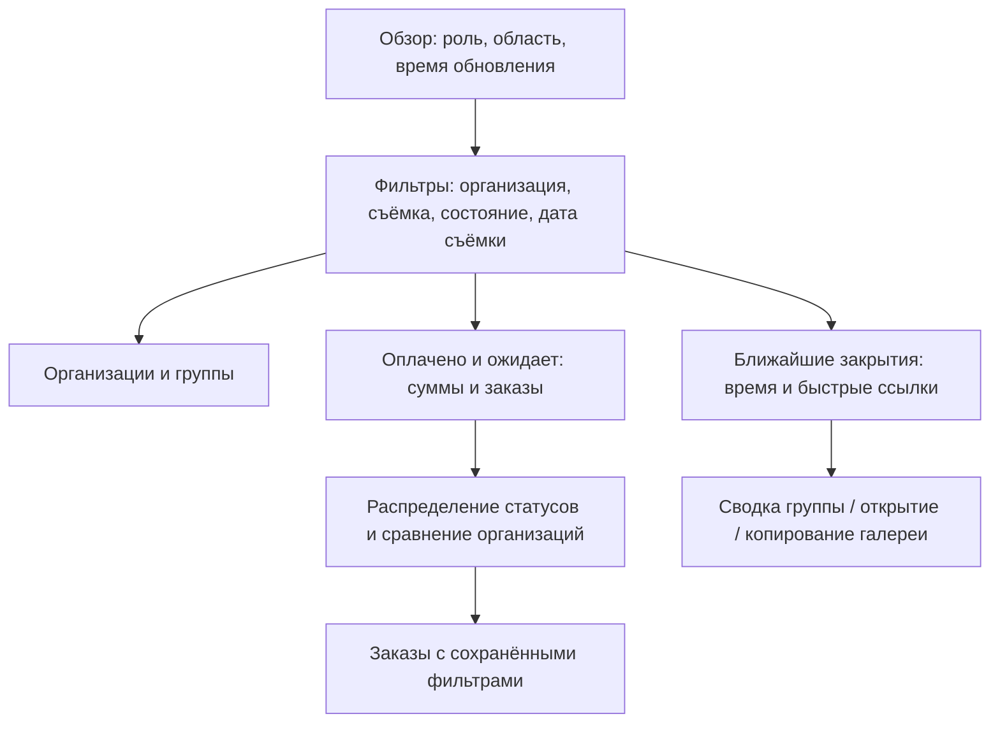

# Дашборды организатора и куратора MoreFoto

## Цель и контекст

Дать организатору и куратору рабочий обзор: сколько доступно организаций и групп, сколько заказов оплачено и ожидает оплаты, какие галереи скоро закрываются и где быстро получить ссылку. Обязательны продуманные виджеты и содержательная инфографика, а не только таблица или набор одинаковых чисел.

Запрос пользователя 2026-09-21: подготовить отдельный план и PR, на этом остановиться. Текущий срез — только документация, уточнение N1 и пакет ревью; интерфейс и API сейчас не реализуются.

- Ветка: `codex/role-dashboard-plan`, от `origin/main` `8cba22c7655b5886d5fe663523214bcd059e674b`.
- Основной план: `docs/waves/graph.json`, волна **N1 «Полные ролевые карточки и сводки»**, затем приёмка N2.
- Канонический план: `/home/user/MoreFoto/docs/04-bitrix-modules/backend-waves.json`; API — соседний `docs/05-rest-api/README.md`.
- PR #35 описывает будущий эквайринг; текущая ветка создана независимо от него, его код/коммиты не переносятся. Конкретный банк не является зависимостью чтения дашборда: используются предметные контракты финансовых владельцев.

## Что подтверждено в коде

| Источник | Факт и вывод для реализации |
| --- | --- |
| `frontend/src/router/MainRoutes.ts` | Есть `/cabinet/overview` → `OverviewPage.vue`, отдельные маршруты учреждений/групп/заказов; развивать существующий кабинет |
| `frontend/src/modules/morefoto/services/cabinet.ts` | `loadCabinetScope` без mock API выбрасывает ошибку «Данные кабинета ещё не подключены»; текущая заготовка не доказывает готовность real API |
| `frontend/src/modules/morefoto/dashboard/components/DashboardBoard.vue`, `DashboardGroups.vue` | Есть фильтры и карточки групп, суммы вычисляются из переданной коллекции; будущие totals нельзя вычислять только по загруженной странице |
| `frontend/src/modules/morefoto/dashboard/snapshot.ts` | Demo-проекция читает mock-каталог/локальные фото; не использовать как backend-реализацию |
| `frontend/src/modules/morefoto/dashboard/useGroupLink.ts` | Копирование сейчас не меняет дату передачи; сохранить эту семантику, получение capability перенести на защищённый запрос |
| `frontend/src/theme/MoreFotoTheme.ts`, `frontend/src/styles/_morefoto-ui.scss` | Есть фирменная светлая тема и токены размеров/отступов/контролов; расширять их без отдельной дизайн-системы |
| ORG-01/ORG-11, HND-01/02, COM-12, ORG-04 | В плане есть ролевые сводки, сроки/ссылки, список заказов и агрегаты; уточнить их контракты до реализации, не заявлять новые маршруты готовыми |

Отдельно найден `frontend/src/views/dashboard/DashboardPage.vue` с Bybit/P2P-содержимым. Это не маршрут обзора MoreFoto; не брать его как шаблон и не удалять в плановом PR.

## Scope, исключения и решения

Входит: два ролевых варианта обзора, KPI, инфографика, сроки галерей, быстрые действия, фильтры, drill-down, семантика денег/времени, доступность/адаптив, источники данных и тесты. Представления разделяют общие компоненты; роль и область определяет сервер.

Не входит: реализация сейчас, торговый/P2P дашборд, BI-конструктор/перетаскивание виджетов, экспорт, автоматическая рассылка ссылок, изменение срока одним кликом, новые права куратора, банковские refund-команды из самого дашборда, управление эквайрингом, новые источники аналитики, редизайн остальных экранов. Дашборд ведёт к существующим сценариям, не дублирует их.

Полная версия включается в N1 после merge её реальных зависимостей **B2, C4, I1, I2, I3, M1** и решения **D06, D08, D10, D12**; финансовые поставщики G1/G2 и заказы E5/F2 приходят транзитивно. Состояние N1 остаётся planned. Более ранний ограниченный срез потребует отдельного решения о границах и изменения DAG, а не mock/нулей вместо отсутствующих денег. N2 проверяет весь пользовательский путь.

### Роли и рабочая задача

| Роль | Область и первый экран | Действия |
| --- | --- | --- |
| Организатор | Все разрешённые организации; сначала общая картина оплат и группы с ближайшим закрытием | Фильтр организации/куратора/съёмки, переход в организацию/группу/заказы, получить или открыть ссылку |
| Куратор | Только назначенные учреждения и их группы; первым блок «Скоро закроются» | Найти группу с неоплаченными заказами, скопировать её галерею, перейти к заказам своей области |

Для куратора даже totals/легенды графиков/значения фильтров не содержат чужих организаций. Отзыв назначения и блокировка действуют при следующем запросе и при получении ссылки; кеш не обходит Access. Пустая область означает «Вам пока не назначены организации», без общих финансов. Другие роли не получают эти дашборды или скрытые в DOM денежные поля; их существующие проекции N1 сохраняются.

### Фильтры и единая выборка

- Общая панель: организация, съёмка, состояние приёма; организатору дополнительно куратор. Поиск по названию организации/группы. Начальное состояние — все доступные организации и все даты, без скрытого ограничения текущим месяцем.
- Необязательный диапазон подписан **«Дата съёмки»**, а не неоднозначное «Период». Он выбирает съёмки и их группы, все цифры относятся к той же выборке на один момент `calculatedAt`.
- Организация без групп входит в счётчик организаций при отсутствии фильтров по дочерним объектам. При фильтре по съёмке/группе считаются организации выбранных групп; `COUNT DISTINCT` исключает дубли от JOIN.
- Счётчики считаются по всей отфильтрованной области, не по первой странице. Пагинация списка не изменяет KPI. При drill-down сохраняются фильтры и обратный путь.
- Query в URL содержит только безопасные фильтры/ID, без galleryToken/ключа заказа; после смены роли/области неподходящие фильтры сбрасываются. Поздний ответ старого запроса не заменяет новую выборку.

## Виджеты и точные значения

| Виджет | Что показывает | Источник и правила | Переход |
| --- | --- | --- | --- |
| Организации | Количество учреждений в выборке | Organization + Access; distinct ID, пустые учреждения учитываются по правилу фильтров | Список выбранных учреждений |
| Группы | Всего, подготовка, приём открыт, приём закрыт | Organization; каждая группа один раз, статус на серверный now | Список групп с выбранным статусом |
| Оплачено | Количество уникальных оплаченных заказов и полученная сумма в ₽ | Commerce + подтверждённые денежные факты Payments/Settlement; попытки и дубли callback не увеличивают счётчик | Заказы с подтверждённой оплатой |
| Ожидает оплаты | Количество неоплаченных оформленных заказов и их сумма | Commerce; только сохранённые заказы с доступной оплатой. Корзины, дети без заказа и прогноз продаж сюда не входят | Неоплаченные заказы выбранной области |
| Платёж проверяется | Pending/unknown отдельно от обычного ожидания | Payments; отсутствующий ответ не означает отказ или оплату; один заказ один раз | Заказы с неопределённым исходом |
| Возвраты и итог | Подтверждённо возвращено, резерв возвратов, остаток после возвратов | Settlement: net = paid − confirmedRefund; pendingReserve отдельно и не вычитается повторно | Финансовая история заказов |
| Скоро закроются | Группы с ближайшим closesAt, осталось времени, неоплаченные заказы и действия ссылки | Organization/Handoff + финансовая сводка; сортировка closesAt, затем стабильный ID | Сводка группы / открыть галерею / скопировать ссылку |

«Оплачено» — исторически подтверждённые деньги до возвратов. Полностью возвращённый заказ сохраняет факт оплаты; net становится нулём, рядом показан возврат. Не выдавать net за исходную оплату. Сумма ожидания — сохранённая сумма заказа на момент расчёта, не обещание будущего платежа; банковский quote может потребовать подтверждения новой цены.

Заказы, для которых обычная оплата уже закрыта, показываются отдельной категорией «Приём закрыт, не оплачено» и не смешиваются с текущим ожиданием. Pending/unknown сохраняются отдельной категорией и после закрытия группы. Поздняя подтверждённая оплата входит в факт paid и отмечается как требующая решения по исполнению; деньги не доказывают разрешение печати/файлов. Сотруднические покупки и повторные покупки считаются по уникальным заказам, не по детям.

## Инфографика — обязательная часть приёмки

1. **Распределение заказов по состоянию оплаты.** Горизонтальная составная полоса: оплачены / ожидают / платёж проверяется / приём закрыт без оплаты. Показывать количество и долю от всех заказов выборки, легенду и абсолютные значения. Возвраты — отдельная ось, не пятый пересекающийся сегмент. При нулевом знаменателе — «Заказов пока нет», без 0/0 и выдуманной доли.
2. **Оплата по организациям.** Сравнимые горизонтальные полосы с суммой paid и подписью net/возвратов; на сводном экране максимум 10 строк и явное «Остальные», сортировка видима. У куратора только свои организации. Переключение на группы после выбора учреждения. Полоса ведёт в соответствующую выборку заказов; это сравнение объёма, не оценка качества работы куратора.
3. **Шкала закрытия галерей.** Группы распределены по ближайшим срокам, рядом список с абсолютной датой и обратным отсчётом; рабочие пороги ≤24 ч, ≤72 ч, позже. Это настройка отображения, не изменение срока продажи. Семантика 24/72 — реальные часы, а не календарные дни; подписи явно различают их.

Во всех диаграммах суммы в копейках преобразуются только при отображении, счётчики — целые. Одинаковая шкала сравнения, без 3D, декоративных спарклайнов и роста «+12%» без данных сравнения. Каждая диаграмма имеет текстовый итог, доступную таблицу значений и клавиатурный переход. Графики не требуют hover, цвет дополняется подписью/маркером. Детализацию временного тренда по дням/экспорт отложить, если она требует нового источника: три перечисленные визуализации достаточны для первого scope.

## Сроки и получение ссылки галереи

- Показывать `closesAt` из Organization и точную дату/время с timezone; отсчёт вычислять от серверного `now`, учитывать дрейф часов браузера. При возврате вкладки/восстановлении сети перечитывать состояние. На границе `now >= closesAt` группа закрыта, после проверки сервера действия обновляются.
- Срок приёма и истечение доступа к купленным файлам — разные сущности. По действующему D10/F2 окно приёма связано с sentAt и календарём; не задавать новые правила и не прибавлять 7 × 24 часов в компоненте. Продление/исправление даты берутся от владельца вместе с историей.
- Пока нет sentAt/closesAt — «Ссылка ещё не передана» или «Срок не назначен», а не отрицательный таймер. Для закрытой группы — «Приём закрыт» и дата; самостоятельное повторное открытие из дашборда отсутствует.
- Получать текущую ссылку **по нажатию** через защищённый HND-02: сервер заново проверяет область и статус. В общей статистике достаточно groupId и allowedActions, массово отдавать galleryToken не нужно.
- «Скопировать ссылку» не выполняет HND-03/04/05, не фиксирует факт отправки, не открывает группу и не продлевает срок. Отправку в чат при необходимости отмечают отдельным существующим действием Handoff.
- Если Clipboard API отказал, показать поле для ручного копирования и понятный статус. Подготовка/закрытие/отзыв ссылки дают объяснение вместо выдачи фиктивного URL. Для закрытой группы доступен переход в служебную карточку; возможность открытия публичной галереи определяется текущим контрактом Handoff.
- Не сохранять capability в аналитике/логах/общем кеше и URL фильтров. Использовать утверждённый origin/маршрут галереи, а не внешний URL из пользовательского поля.

## Визуальное направление и схема экрана

Пользователь утром проверяет ход фотосъёмок и сразу переходит к группе, где заканчивается приём. Ощущение — спокойный рабочий кабинет фотостудии с ясными цифрами и заметными сроками. Визуальный ориентир — существующая MoreFotoTheme; отдельную палитру или новый UI framework не вводить.

Предметный язык: учреждение, съёмка, группа, галерея, приём заказов, передача ссылки, оплата. Цветовой мир уже определён темой: белая поверхность, светлый серо-голубой фон, синий акцент, тёмный текст, зелёный подтверждённой оплаты, охра срока, красный ошибки. Все значения брать из текущих semantic tokens, размеры/отступы — `_morefoto-ui.scss`; число/валюта/таймер с tabular numerals. Спокойные границы/контраст поверхности, без разноцветных градиентных плиток.

Фирменный элемент этого дашборда — **карточка группы со шкалой оставшегося приёма, оплатой и доступом к галерее в одном месте**. Организатору общий денежный итог крупнее вторичных счётчиков; куратору блок ближайших закрытий выше сравнительной диаграммы. Обязательный числовой обзор остаётся у обеих ролей.

Отклоняем три шаблонных решения: одинаковые KPI-плитки на весь экран → иерархия главного итога и компактных счётчиков; круговые диаграммы ради декора → сопоставимые полосы с подписями; огромная таблица со ссылками → приоритетный список ближайших закрытий и компактная подробная выборка ниже.

Desktop ≥1280: 12-колоночная сетка, компактные KPI сверху, основной финансовый/сравнительный блок 8 колонок и ближайшие закрытия 4, детализация ниже. Для куратора блок сроков расположен первым по порядку чтения. Tablet ~768: две колонки, фильтры переносятся без обрезания. Mobile 360–390: одна колонка; сначала главные суммы и ближайшие сроки, потом диаграммы/детализация; длинное название переносится, действия минимум 44 px. Не требовать горизонтального скролла всей страницы.

Обязательные состояния: skeleton без прыжка сетки, ready-zero, нет организаций, нет совпадений фильтра, зависимости не подключены, ошибка/повтор, устаревшие данные с временем расчёта, частично недоступный раздел только при явно согласованном API-контракте. Не подменять unavailable нулями. После потери прав старые данные очищаются, а не остаются под сообщением ошибки. Контраст текста не ниже 4.5:1, focus видим, reduced-motion, доступные подписи и легенды.

## API, модули и производительность

- Основной read-сценарий — ORG-01 `/cabinet/scope`, групповой — ORG-11; серверная projection/use case в Organization агрегирует только через публичные контракты владельцев. Organization — структура/сроки, Access — назначения/права, Commerce — заказ и ожидаемая сумма, Payments/Settlement — подтверждённые деньги/возвраты, Handoff — выдача актуальной ссылки.
- До реализации закрепить типизированные Request/Result DTO: единая область/фильтры, counts/amounts, распределение статусов, сравнение организаций/групп, ближайшие deadlines, `now/calculatedAt`, версии области, состояние доступности и пагинация. Проверить совместимость существующих ORG-01/11; если ответу потребуется отдельный endpoint, сначала согласовать владельца/ID и обновить API-генератор/Postman, не выдумывать номер сейчас.
- Агрегация на сервере по всей разрешённой выборке, фильтр области до GROUP BY/пагинации. Batch/SQL/ORM Result без Objectify, N+1 по организациям/группам/заказам и гидрации всех фото. В HTTP только DTO, без чужого ORM/Result; ServiceLocator только DI/bootstrap.
- Один логический snapshot с известным временем и версиями источников; нельзя складывать произвольные несогласованные ответы страниц. Кеш зависит от области/accessRevision, фильтров и версий данных, разрешение повторно проверяется перед выдачей. Capability в кеш агрегатов не включать.
- Измерить query count/планы индексов на согласованном реалистичном объёме; оценить рост при десятикратном количестве групп. Число запросов ограничено числом источников, а не количеством строк. Не обещать миллисекунды до измерений.
- Плановый PR не меняет 99 API ID, обратные unlocks, runtime-зависимости и состояния волн; добавляет конкретные требования scope/review/acceptance N1.

## Checklist текущего среза

- [x] P1. Прочитать инструкции, текущий frontend/API и N1; проверить PR и актуальный main.
- [x] P2. Создать независимую ветку и plan/progress до изменения графа.
- [x] P3. Зафиксировать роли, показатели, сроки, UI/инфографику и критерии приёмки.
- [x] P4. Уточнить N1 в активном и каноническом плане, пересобрать Markdown и сохранить отдельный patch.
- [x] P5. Проверить оба DAG, 99 ID, отсутствие зависимостей от PR #35, согласованность N1 и diff.
- [ ] P6. Закоммитить, опубликовать ветку и создать отдельный PR в main; оставить реализацию отложенной.

## Критерии приёмки будущего дашборда

Обе роли имеют свой работающий overview; деньги и область соответствуют серверу. Все запрошенные показатели, три вида инфографики и сроки видны; ссылка доступна прямо из списка ближайших закрытий. Копирование не меняет календарь. Каждый виджет имеет drill-down/легенду и состояния. Полный/частичный возврат, неизвестный платёж, пустая выборка и отзыв прав не искажают показатели. Реальный HTTP/E2E на изолированной БД и визуальная проверка desktop/tablet/mobile обязательны; demo fixtures их не заменяют.

## Тест-кейсы планового PR

| ID | Предусловия / действие | Ожидаемый результат / команда |
| --- | --- | --- |
| DOC-01 | Проверить branch/base и собственные коммиты | Основа — main, не #35: `git merge-base HEAD origin/main`; `git log --oneline origin/main..HEAD`; `git diff --name-only origin/main...HEAD` |
| DOC-02 | Уточнён N1, запустить штатный валидатор | 40 волн, 99 ID, 35 WNN, все negative fixtures: `python3 tools/verify-wave-graph.py docs/waves/graph.json` |
| DOC-03 | Обновлён MoreFoto N1 | Его validator PASS; N1/99 владельцев API/dependsOn/unlocks совпадают, различия вне N1 не затираются: `python3 /home/user/MoreFoto/docs/04-bitrix-modules/wave_graph.py /home/user/MoreFoto/docs/04-bitrix-modules/backend-waves.json`; scoped comparison |
| DOC-04 | Генерация Markdown и patch | Повторная генерация воспроизводима, reverse-check patch PASS: `python3 /home/user/MoreFoto/docs/04-bitrix-modules/render-waves.py`; `git -C /home/user/MoreFoto apply --check --reverse /home/user/rabit-api/docs/waves/role-dashboard/morefoto-plan-sync.patch` |
| DOC-05 | Staged diff и публикация | Только документы, whitespace PASS, PR base=main и HEAD совпадает: `git diff --cached --check`; `gh pr view --json url,baseRefName,headRefName,headRefOid` |

## Тест-кейсы реализации (планируются, сейчас не выполняются)

Backend: профильные unit/integration/architecture проверки на изолированном Bitrix/MySQL, команды уточнить по Makefile реализации. Frontend: доступные scripts package.json, затем `make test-e2e` по `docs/waves/a8/README.md`; для экранов реальные desktop/tablet/mobile screenshots. Фикстуры не должны обращаться к боевому банку.

| ID | Предусловия / действие | Ожидаемый результат |
| --- | --- | --- |
| UX-01 | Организатор, несколько учреждений/групп, разные фильтры/страницы | counts/денежные итоги полные и consistent; totals не зависят от страницы, drill-down сохраняет фильтры |
| UX-02 | Куратор с двумя назначениями и третьим чужим учреждением; затем отзыв | Чужие суммы/названия/ссылки отсутствуют в ответе и DOM; кеш и поздний ответ не возвращают отозванные данные |
| UX-03 | Нет назначений, учреждение без групп, нет заказов/совпадений | Разные понятные empty states, истинные нули только для доступной пустой выборки |
| UX-04 | Один заказ, несколько попыток и дубли webhook; pending/unknown/late payment | Уникальные заказы, корректные отдельные статусы, никакой двойной суммы |
| UX-05 | Частичный/полный refund и pendingReserve | paid сохраняется, net = paid-confirmed; резерв отдельно, не двойное вычитание |
| UX-06 | preparing/open/closed, граница closesAt, timezone/часы клиента/продление | Серверный срок/статус, нет отрицательного таймера или смешения со сроком файлов |
| UX-07 | Нажать copy/open; запрет clipboard, отозванная/закрытая ссылка | Верная галерея своей группы или понятный отказ; sentAt/closesAt/история передачи не меняются |
| UX-08 | Диаграммы при 0/1/многих строках, легенда, клавиатура, reduced-motion | Корректный знаменатель/шкала, текстовый эквивалент и рабочий drill-down |
| UX-09 | 360/390, 768, 1440 px, длинные имена, крупные ₽ | Читаемые виджеты, без наложений и горизонтального скролла страницы; touch/focus доступны |
| UX-10 | Медленный старый ответ, новый фильтр, ошибка поставщика/нет сети | Новые фильтры не откатываются; unavailable/error не превращаются в ноль или demo |
| UX-11 | Реалистичная БД и десятикратный рост числа групп | Нет N+1; планы запросов/объём ответа/кеш scope измерены и сохранены |
