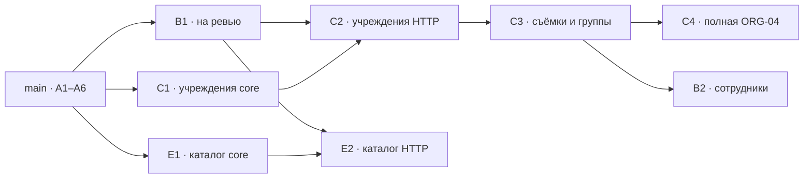

# A7 — независимые волны и граф

Раньше правила требовали следующую ветку поверх предыдущей. Теперь каждая волна начинается от актуального `main`, содержит завершённый сценарий и отдельно сливается в `main`. Необходимые runtime/compile/schema зависимости уже должны быть слиты. Незамерженные блокеры пропускаются; несколько готовых волн выполняются одновременно. Это обязательное правило пользователя от 11.09.2026.

A7 меняет правила, граф и генераторы. В runtime не добавляет код и не блокирует B1/C1/E1. База этого PR — `2ac4ef9b3e4b63d734fc3dda5240cab50a550d44`, та же принятая основа A1–A6. GitHub Actions остаётся отключённым; YAML не меняется.

| Направление | Смысл |
| --- | --- |
| A | Основа и правила |
| B | Access |
| C | Organization |
| D | Media |
| E | Commerce |
| F | Handoff |
| G | Payments |
| H | Notification |
| I | Settlement |
| J | Files |
| K | Support |
| L | Production |
| M | Shipping |
| N | Итоговые проекции и приёмка |

[Полный граф](graph.json) содержит 39 срезов, вход/выход, `dependsOn` и обратные `unlocks`. [Карта WNN](legacy-map.md) сохраняет все 35 прежних ID. Буквы обозначают предметные направления, не очередность. Статусы — проверяемый снимок, а не live-интеграция с GitHub; перед следующим стартом обновить main и факт merge.

| Сейчас | Что работает отдельно | Зависимости | Что разблокирует |
| --- | --- | --- | --- |
| B1 / PR #8 | Профиль и серверная политика доступа | A3, A5, A6 в main | C2, B2, E2; у каждого остаются свои другие зависимости |
| [C1 / PR #9](https://github.com/rebit-pro/rabit-api/pull/9) | Внутренние create/update/get/list учреждения, HL, UUID/CAS, поиск/пагинация, DI | A6 в main | C2 |
| [E1 / PR #10](https://github.com/rebit-pro/rabit-api/pull/10) | Внутренние create/update/list Product, БД/global catalogRevision, DI, пустой каталог | A6 в main | E2 |
| [A7 / PR #11](https://github.com/rebit-pro/rabit-api/pull/11) | Проверяемое правило и граф | A6 в main | Не является runtime-блокером |



C1/E1 не импортируют B1 и не открывают HTTP. Это готовые внутренние сценарии с хранением/DI/проверкой, а не набор интерфейсов для будущего кода. C2 добавляет защищённые ORG-02/03/05 и минимальные institution assignments Access. C3 добавляет структуру и групповые назначения; C4 получает настоящий shoots/groups и обязательный summary union. До финансового поставщика допустим принятый unavailable, ошибка уже подключённого поставщика даёт 503; финальный ready проверяется в N1.

E2 добавляет только COM-01/02/03 после B1/E1. Управление сотрудниками B2 и фотографии D2 не нужны для каталога. D02 не утверждён: пустое редактируемое хранилище допустимо, demo seed/утверждение цен не добавляются; коммерческие правила E3 ждут решения. D1 получает область через C3 и не требует UI сотрудников B2. H1 не импортирует Payments: внутренний транспорт остаётся заблокирован открытым D09; интеграция чеков принадлежит G2.

Повторные проверки API — отдельные метаданные, не runtime-рёбра. Переименование не меняет method/path/payload или статус реализации. R17 остаётся отдельной приёмкой. Ни PR #8, ни текущая работа C1/E1 не считаются merged автоматически.

Проверка каждого PR: актуальный main + только собственный diff, установка миграций/DI, значимые сценарии. После изменения base повторить затронутые проверки. Совместная проверка не заменяет независимую. Merge и deployment выполняются отдельно после ревью.

## Воспроизводимость

```sh
python3 tools/verify-wave-graph.py docs/waves/a7/graph.json
```

[Отчёт проверок](verification.json), [переносимый patch исходников MoreFoto](morefoto-plan.patch) и [before/after хеши](morefoto-sync.json) позволяют проверить канон без копирования больших generated JSON в PR. MoreFoto не Git-репозиторий; SHA его коммита не выдумывается. Patch применяется из корня MoreFoto (`git apply --unidiff-zero --check`, затем `git apply --unidiff-zero`); перед применением сверить before-хеши. Затем выполнить команды генерации из канонического backend-waves.md. Generated артефакты подтверждены after-хешами.

Замороженные docs/waves/w00 и tools/verify-w00-inventory.py не меняются. Проверки плана/Postman выполняются без HTTP; они не доказывают работу продуктового API.

## Совместимость текущего набора

[Отчёт независимости B1/C1/E1/A7](cohort-verification.json): общих изменённых файлов нет; все 24 порядка слияния дают одно дерево. Временное объединение проходит PHPUnit (207 тестов, 778 assertions) и PHPStan. Ветки продуктовых PR остаются отдельными от main; общий checkout использован только для проверки. Самостоятельные native-проверки C1 (31) и E1 (51) выполнялись без B1.
